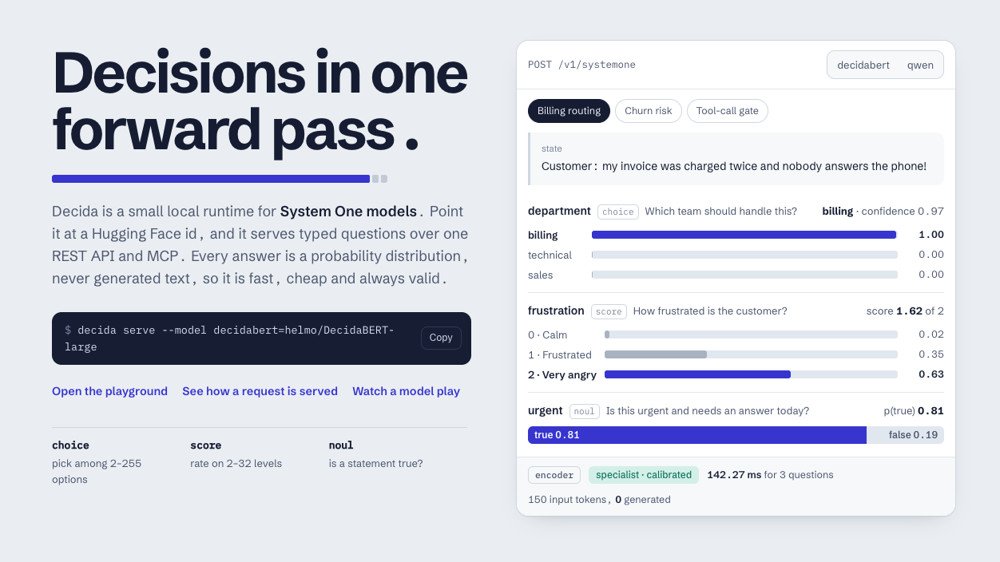

# Decida

Decida is a local runtime for **System One models**: models that read a **state** and a set of typed **questions** and answer all of them in **one forward pass**, with no generated text. Every answer is a probability distribution, so it is fast, cheap and always valid, and your code can act on the numbers.

It loads models from Hugging Face, serves them over one REST API and an MCP server, and comes with a testbench of small games and tools for seeing how a model really behaves.



*A real response from a local server (DecidaBERT-large on an Apple GPU), not a mock-up.*

| question type | you give | you get back |
|---|---|---|
| `choice` | 2 to 255 options, each with a description | a probability for every option |
| `score` | an ordered list of levels, lowest first | a probability for every level, and the expected level |
| `noul` | a yes/no question about the state | the probability that the statement is true |

## Install and run

```bash
uv tool install git+https://github.com/heldernoid/decida     # a global `decida` command
decida serve                                                # then open http://127.0.0.1:8000
```

The first run creates `~/.decida/settings.json` with a default set of models. By default each model is only downloaded, and then loaded into RAM or VRAM, on its **first request** to it (a curl, a bench, `decida check`), so a plain `decida serve` returns instantly and neither downloads nor loads a model until you actually use one. To fetch the weights ahead of time without loading them (handy on a slow link, or before going offline), without touching memory:

```bash
decida pull                                          # every model in settings.json, to the Hugging Face cache
decida pull helmo/DecidaBERT-large helmo/Qwen3-0.6B  # only these
```

`--no-lazy` on `decida serve` instead downloads **and loads** every configured model before the server accepts requests; only use it if you have the RAM or VRAM for all of them at once, since Decida does not check that a model fits before loading it (see Settings, data and devices, below). On a small GPU, prefer `decida pull` up front and let each model still load lazily, on demand. From a clone of this repository, use `uv sync` and `uv run decida serve` instead.

```bash
decida setup                          # add or remove models, or restore the defaults
decida pull                           # download every configured model, without loading any of them
decida serve --model decidabert=helmo/DecidaBERT-large --model qwen=helmo/Qwen3-0.6B    # or serve exactly these
decida list                           # what a running server has loaded, and on which device
decida check helmo/Qwen3-0.6B         # 14 wiring checks against a model
decida detect helmo/laya:typed-decisions      # which backend would serve it (reads file names only)
decida predict --model helmo/DecidaBERT-large --state state.json --questions questions.json
decida data download wikispeedia      # the data one bench needs (about 840 MB)
decida mcp                            # tools for a coding agent (needs a running `decida serve`)
```

## The models it ships with

| alias | model | what it is | licence |
|---|---|---|---|
| `decidabert` | [helmo/DecidaBERT-large](https://huggingface.co/helmo/DecidaBERT-large) | Decida's own 421M parameter encoder, trained for typed decisions | Apache-2.0 |
| `laya-typed-decisions` | `helmo/laya:typed-decisions` | Laya's typed-decisions checkpoint | Apache-2.0 |
| `laya` | `helmo/laya` | Laya, English checkpoint | Apache-2.0 |
| `laya-multilingual` | `helmo/laya:multilingual` | Laya, multilingual checkpoint | Apache-2.0 |
| `qwen` | [helmo/Qwen3-0.6B](https://huggingface.co/helmo/Qwen3-0.6B) | a general language model, read zero-shot through option letters | Apache-2.0 |
| `jev` | TypeSafe Jev (hosted) | a hosted model, used as a reference; see below | TypeSafe's terms |

`helmo/laya` and `helmo/Qwen3-0.6B` are unmodified copies of [convaiinnovations/laya](https://huggingface.co/convaiinnovations/laya) and [Qwen/Qwen3-0.6B](https://huggingface.co/Qwen/Qwen3-0.6B), kept as a backup so they can always be downloaded. Each copy has a `MIRROR.md` with the original commit and file hashes. Any Hugging Face model can be added: Decida detects whether it is an encoder checkpoint, a causal language model, or a Contrastive-LM checkpoint, and `username/model-id:folder` picks one checkpoint out of a repository that holds several.

## Using it

```bash
curl -s localhost:8000/v1/systemone -H 'content-type: application/json' -d '{
  "model": "decidabert",
  "state": "Customer: I was billed twice for March and want my money back.",
  "questions": {
    "team": {"type": "choice", "instructions": "Which team should handle this?",
             "criteria": {"billing": "Charges, invoices, refunds",
                          "technical": "Bugs and outages",
                          "sales": "Pricing, demos, new seats"}},
    "urgent": {"type": "noul", "instructions": "Is this urgent?"}
  }}'
```

| endpoint | purpose |
|---|---|
| `POST /v1/systemone` | one state and its questions, answered in one pass |
| `POST /v1/systemone/batch` | up to 256 independent requests in one call, answered concurrently |
| `GET /v1/models`, `POST /v1/models`, `DELETE /v1/models/{name}` | list, add or unload a model |
| `POST /v1/check` | the 14 smoke checks against a loaded model |
| `GET /v1/device`, `GET /metrics`, `GET /health` | device and memory, latency percentiles, liveness |
| `GET /v1/datasets`, `POST /v1/datasets/{id}/download` | the data the benches use |

The MCP server (`decida mcp`) gives a coding agent `gate_tool_call`, `vet_dependency`, `triage_failure`, `classify_text` and a raw `decide` tool.

## The testbench

Open the **Testbench** page of the running server. Each bench is a static page that talks only to the public API and shows every decision, its distribution and its latency.

| bench | what it tests |
|---|---|
| T-Rex runner, Snake, Flappy, Tetris | real-time games where the model chooses every few frames, with an exact oracle to score each choice |
| Candies sorter | one small question per candy, 256 per request, sorted into five bowls |
| Colour palette, Emoji finder | how well a model matches a phrase to colours or emoji |
| Wikispeedia | click through real articles, with images, from a start page to a goal page; compared with recorded human averages |
| AI Town | one announcement, fifty citizens, each deciding what to do, with a stopwatch over the whole town |
| Model compare | the same questions to several models side by side, plus a hand-written labelled set that scores accuracy, confidence and latency |

The Candies sorter and AI Town ideas come from Matthew Berman's video "We need to talk about Jev...", the colour palette from Matt DesLauriers and the emoji finder from Stefan (@heystefan_). None of them published code; the designs and implementations here are our own. See `THIRD_PARTY.md`.

## Results

[DecidaBERT-large](https://huggingface.co/helmo/DecidaBERT-large) on the 400 held-out cases (2,000 questions) of [LocalLLaMA/typed-decisions](https://huggingface.co/datasets/LocalLLaMA/typed-decisions), scored by top-answer accuracy. It was trained on that benchmark's training split, so this is a **specialist** result.

| model | overall | choice | score | yes/no |
|---|---|---|---|---|
| DecidaBERT-large | **0.743** (95% interval 0.723 to 0.762) | 0.722 | 0.694 | 0.830 |
| Laya, typed-decisions checkpoint | 0.761 | 0.738 | 0.715 | 0.847 |
| Qwen3-0.6B, zero-shot | 0.383 | 0.350 | 0.281 | 0.550 |

We do not claim that DecidaBERT-large beats any other model: Laya's specialist checkpoint scores higher, and the benchmark's labels are noisy. The model card lists what was measured, how, and what was not. The scoring script is `eval_typed_decisions.py` in the [model repository](https://huggingface.co/helmo/DecidaBERT-large).

## Hosted models

Decida can forward requests to a hosted System One endpoint, listed by its URL. It is meant for benchmarking and comparison, and it is off unless you set an API key:

- The key is read from the environment variable named in the settings (`TYPESAFE_API_KEY` by default) and is **never written to disk or logged**.
- Spend is estimated from token counts and **capped** (`$1` by default, `--remote-budget-usd`). Requests stop when the cap is reached.
- Use of a hosted service is under its own terms. Do not use a hosted model's outputs as training data.

Decida is an independent project and is not affiliated with TypeSafe, Convai Innovations or any other model author.

## Settings, data and devices

- `~/.decida/settings.json` holds the model list and server options (`DECIDA_HOME` moves it). It holds no secrets.
- Bench datasets go to `~/.decida/datasets/` (`DECIDA_DATA_DIR` overrides it). Model weights stay in Hugging Face's own cache.
- The device is chosen as CUDA, then Apple GPU (MPS), then CPU, and `--device` overrides it. Encoder models run in float32. On an Apple GPU models take turns, because PyTorch's Metal backend is not thread safe.
- Decida does not check that a model fits before loading it, and it does not unload models by itself. The Models page has an Unload button, and `decida setup` removes models from the list.

## Writing questions that work

What the testbench showed, model after model: put the state in words and never in raw numbers; ask what the text says, not what to do; describe every option, because the option text is what the model matches against; keep option lists short and only offer options that are reachable; and let your own code do the measuring and choosing, using the model for perception questions. Watch `x_decida.truncation` in the response to see whether any text was cut.

## Development

```bash
uv sync --all-extras          # or: make setup
make test                     # pytest and the JavaScript tests (node --test)
make lint                     # ruff and pyright
```

The tests that need a tokenizer fetch the small tokenizer files of `helmo/DecidaBERT-large` from the Hub (cached), or read a folder named in `DECIDA_TEST_TOKENIZER`. Decida runs models; it does not train them or generate data. The code is under `src/decida/`: `runtime/` (detecting, loading and locating models), `serve/` (the engines and the API), `model/` (the encoder), `schema/` (the typed questions and answers), and `web/` (the home page and the benches).

## Limitations

- Encoder models match the state against the options you give. They have little world knowledge, so tasks that need facts (for example, which page mentions which) suit larger models better.
- Only English has been tested. Small models read text well but are weak at telling one person's reaction from another's; the AI Town bench shows this and says which mode it ran.
- Testing focused solely on Apple Silicon (Apple GPU through MPS). Decida is wired to run on CPU on other systems and on CUDA, but those paths are untested.

## Licence

Apache-2.0, see `LICENSE`. Third-party code, ideas and data are credited in `THIRD_PARTY.md`, with their licence texts in `third_party/licenses/`.
