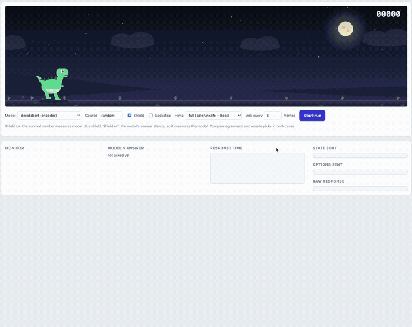

# Decida

Decida is a local runtime for **System One models**: models that read a **state** and a set of typed **questions** and answer all of them in **one forward pass**, with no generated text. Every answer is a probability distribution, so it is fast, cheap and always valid, and your code can act on the numbers.

It loads models from Hugging Face, serves them over one REST API and an MCP server, and comes with a testbench of small games and tools for seeing how a model really behaves.

<p align="center">
  
</p>

*A real local Decida server on Apple GPU.*

| question type | you give | you get back |
|---|---|---|
| `choice` | 2 to 255 options, each with a description | a probability for every option |
| `score` | an ordered list of levels, lowest first | a probability for every level, and the expected level |
| `noul` | a yes/no question about the state | the probability that the statement is true |

## Install

```bash
uv tool install git+https://github.com/heldernoid/decida     # a global `decida` command
decida serve                                                # then open http://127.0.0.1:8000
```

Works out of the box on **Apple Silicon** (Apple GPU through MPS) and **NVIDIA GPUs** (CUDA), with no extra steps.

**AMD GPU (ROCm)**: one extra install step, since the standard `torch` wheel is CUDA-only:

```bash
uv pip install --no-config --python "$(uv tool dir)/decida/bin/python" \
  --index-url https://stable.repo.amd.com/rocm/whl-next/ \
  "torch==2.12.0+rocm10.0.0" "amd-torch-device-gfx1151"
```

Replace `gfx1151` with your GPU's architecture (`rocminfo | grep "Name:.*gfx"`). Full AMD details (development install from a clone, the `--no-sync` gotcha, tested hardware) are in [DOCS.md](DOCS.md#amd-gpu-rocm).

From a clone of this repository, use `uv sync` and `uv run decida serve` instead.

## Getting started

The first run creates `~/.decida/settings.json` with a default set of models. By default each model is only downloaded, and then loaded into RAM or VRAM, on its **first request** (a curl, a bench, `decida check`), so a plain `decida serve` returns instantly and touches nothing until you actually use a model.

```bash
decida setup                          # add or remove models, or restore the defaults
decida pull                           # download every configured model, without loading any of them
decida list                           # configured models and whether each is downloaded (no server needed)
decida serve --model decidabert=helmo/DecidaBERT-large --model qwen=helmo/Qwen3-0.6B    # or serve exactly these
decida ps                             # what a running server has loaded, and on which device
decida mcp                            # tools for a coding agent (needs a running `decida serve`)
```

```bash
curl -s localhost:8000/v1/systemone -H 'content-type: application/json' -d '{
  "model": "decidabert",
  "state": "Customer: I was billed twice for March and want my money back.",
  "questions": {
    "team": {"type": "choice", "instructions": "Which team should handle this?",
             "criteria": {"billing": "Charges, invoices, refunds",
                          "technical": "Bugs and outages",
                          "sales": "Pricing, demos, new seats"}},
    "urgent": {"type": "noul", "instructions": "Is this urgent?"}
  }}'
```

**[DOCS.md](DOCS.md)** has every command in depth with examples, the full model list, the REST API, the testbench, benchmark results, hosted models, settings/data/devices, and how to write questions that work well. **[MCP.md](MCP.md)** covers the MCP server, including a browser UI to try its tools with no client config.

## Licence

Apache-2.0, see `LICENSE`. Third-party code, ideas and data are credited in `THIRD_PARTY.md`, with their licence texts in `third_party/licenses/`.
